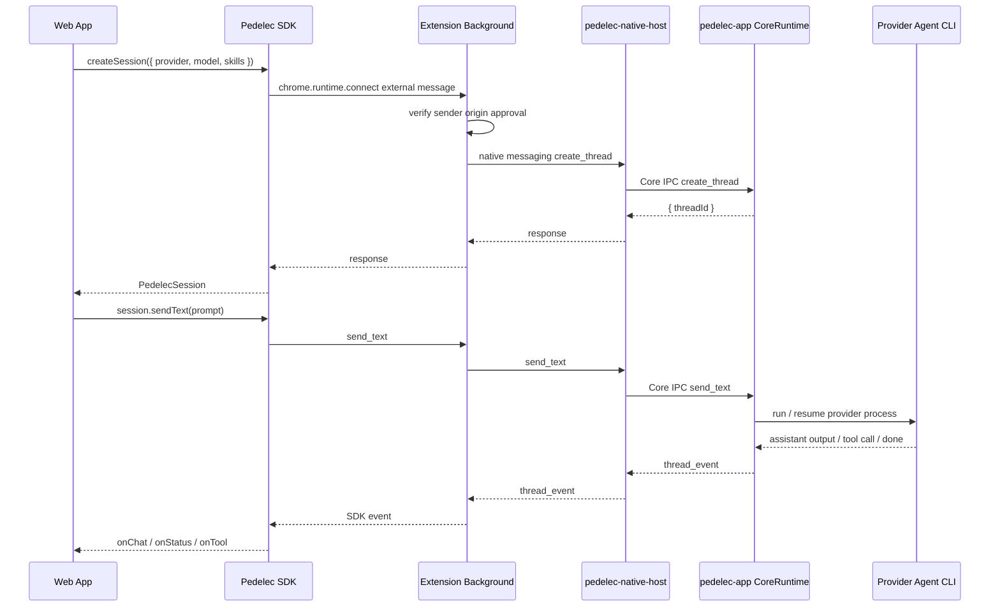

English | [繁體中文](./README.zh-TW.md)

---

## Thanks for your patience — just a little longer.

The Pedelec App is still under review, but we expect the first official Windows and macOS desktop versions to be available very soon.

---

### ➡️ [Pedelec Document](https://kaoruisaac.github.io/pedelec) 🔗

Pedelec is a bridge architecture that lets web frontends call local AI coding agents.

Its core goal is: **to let a Web App create agent sessions through the SDK, send user messages, receive streamed agent responses, and safely hand tool calls back to the Web App whenever the agent needs to operate on frontend state.**

The overall data flow can be understood as:

```txt
Web App / SDK
  ↓ chrome.runtime.connect(extensionId)
Chrome Extension Background
  ↓ origin approval gate
  ↓ Chrome Native Messaging
pedelec-native-host
  ↓ Core IPC
pedelec-app Desktop Runtime
  ↓ provider process
Codex / Gemini / OpenCode / Cursor / Claude Code / Ollama via pedelec-agent
```

The Web App does not directly touch local processes and does not need to start its own localhost server. The SDK only communicates with the extension; the extension forwards requests to the native host; the desktop app is the only CoreRuntime owner and is responsible for creating sessions, managing provider processes, forwarding events, and handling tool results.

---

## Repo Structure

```txt
sdk/        TypeScript SDK used by Web Apps
extension/  Chrome extension responsible for external SDK connections, origin approval, and the native messaging bridge
desktop/    Tauri desktop app, CoreRuntime, native host, and pedelec-cli
```

---

## SDK Prerequisites

The Pedelec SDK must run in a browser page environment and requires:

1. The user has installed the Pedelec Chrome Extension.
2. The user has started the Pedelec Desktop App.
3. The Desktop App has registered the Chrome Native Messaging host.
4. The target provider is available on the user's machine. CLI-backed providers use commands such as `codex`, `gemini`, `opencode`, `cursor`, or `claude`; the Ollama provider uses Pedelec's bundled `pedelec-agent`.

The SDK is not suitable for direct use in Node.js, an SSR server, or a background worker; it needs extension runtime messaging from a Chrome page environment.

---

## Installing and Importing the SDK

The SDK package is located in `sdk/`:

```bash
cd sdk
npm install
npm run build
```

Import it from the Web App:

```ts
import { Pedelec, defineTool } from "@kaoruisaac/pedelec";
```

If it has not been published to npm yet, install it from a local path first:

```bash
npm install ../path/to/pedelec/sdk
```

---

## Minimal Example

```ts
import { Pedelec, defineTool } from "@kaoruisaac/pedelec";

const pedelec = new Pedelec();

const session = await pedelec.createSession({
  provider: "codex",
  model: "gpt-5",
  skills: {
    guidance: "Use get_current_page when you need browser page context.",
    tools: [
      defineTool({
        name: "get_current_page",
        description: "Read the current browser page title and URL.",
        argsSchema: {
          type: "object",
          properties: {},
          required: [],
        },
        handler: () => ({
          url: location.href,
          title: document.title,
        }),
      }),
    ],
  },
});

session.onChat((text) => {
  // Incremental text stream from the agent.
  console.log(text);
});

session.onStatus((status) => {
  // idle | running | waiting_tool_result | ended | error
  console.log("status", status);
});

session.onError((error) => {
  console.error(error.code, error.message, error.details);
});

await session.sendText("Please help me analyze the current page state");
```

`sendText()` resolves after the current agent response completes. If the session is already handling a previous prompt, the new `sendText()` call is rejected to prevent multiple concurrent requests from running in the same session.

---

## Creating a Session

The first time an origin calls `createSession()` or `resumeSession()`, the extension asks the user to approve that origin in the popup. After approval, the same origin can create sessions directly.

You can query the current origin's approval status first to decide whether to show UI such as "Connect Pedelec":

```ts
const status = await pedelec.getApprovalStatus();

console.log(status.installed, status.approved, status.origin);
```

### Specifying Provider and Model

```ts
const session = await pedelec.createSession({
  provider: "opencode",
  model: "ollama/qwen2.5-coder:14b",
});
```

Currently supported provider codes in the SDK:

| Provider | Code | Example model |
| --- | --- | --- |
| Codex | `codex` | `gpt-5` |
| Gemini | `gemini` | Any model ID supported by the provider |
| OpenCode | `opencode` | `ollama/qwen2.5-coder:14b` |
| Cursor | `cursor` | `gpt-5` |
| Claude Code | `claude` | `sonnet` |
| Ollama | `ollama` | `qwen3-14b-32k:latest` |

Ollama sessions are executed by the `pedelec-agent` binary bundled with the Desktop App, not by the `ollama` CLI. You still need to start the local Ollama server yourself and specify a model explicitly or configure `defaultModels.ollama` in Settings:

```ts
const session = await pedelec.createSession({
  provider: "ollama",
  model: "qwen3-14b-32k:latest",
});
```

### Using the Desktop App's Default Provider

If the Desktop App has a default provider configured, you can omit `provider`:

```ts
const session = await pedelec.createSession({
  skills: {
    guidance: "Use update_counter when the user asks to change the counter.",
    tools: [
      defineTool({
        name: "update_counter",
        description: "Update the visible counter by delta.",
        argsSchema: {
          type: "object",
          required: ["delta"],
          properties: {
            delta: {
              type: "number",
              description: "Counter delta.",
            },
          },
        },
      }),
    ],
  },
});
```

This first reads `defaultProvider` and `defaultModels` from the Desktop App. If no default provider is configured, the SDK throws `DEFAULT_PROVIDER_NOT_SET`. If the default provider has its own default model, the SDK sends that model with the session request.

### Specifying Only the Provider

```ts
const session = await pedelec.createSession({
  provider: "codex",
});
```

When only `provider` is passed, the SDK uses that provider's own Desktop App default model if one is configured. Otherwise, it sends the provider without a model and lets the provider CLI use its own default behavior.
Ollama is the exception: it requires a model, so provider-only Ollama sessions need `defaultModels.ollama` or they fail with `MODEL_REQUIRED`.

### Session Lifecycle

SDK-created sessions are page-scoped by default. `autoEndOnDisconnect` defaults to `true`, so Pedelec automatically ends the Desktop thread when the last SDK connection for that session disconnects, such as on page refresh or tab close.

Use the default for demos and page-scoped apps. Set `autoEndOnDisconnect: false` only when you need to resume the same session after navigation or share it across pages:

```ts
const session = await pedelec.createSession({
  provider: "codex",
  autoEndOnDisconnect: false,
});
```

---

## Listing Providers

```ts
const providers = await pedelec.listProviders();

for (const provider of providers) {
  console.log(provider.code, provider.available, provider.path, provider.error);
}
```

Return format:

```ts
type ProviderInfo = {
  name: string;
  code: "codex" | "gemini" | "opencode" | "cursor" | "claude" | "ollama";
  path: string | null;
  available: boolean;
  error: string | null;
};
```

`available: false` usually means that the provider CLI is not installed or is not in `PATH`.
For Ollama, `available: true` only means Pedelec can find `pedelec-agent`; it does not mean the Ollama server is running or the selected model is installed.

---

## Reading Desktop App Settings

```ts
const settings = await pedelec.getSettings();

console.log(settings.defaultProvider);
console.log(settings.defaultModels.codex);
console.log(settings.defaultModels.gemini);
console.log(settings.defaultModels.ollama);
```

Return format:

```ts
type PedelecSettings = {
  defaultProvider: "codex" | "gemini" | "opencode" | "cursor" | "claude" | "ollama" | null;
  defaultModels: Partial<Record<"codex" | "gemini" | "opencode" | "cursor" | "claude" | "ollama", string>>;
};
```

---

## Receiving Agent Responses

```ts
const chunks: string[] = [];

session.onChat((text) => {
  chunks.push(text);
  render(chunks.join(""));
});
```

`onChat()` receives incremental text. It may not be a complete sentence or a complete paragraph. The UI usually needs to accumulate chunks into a complete message.

---

## Listening to Session Status

```ts
session.onStatus((status) => {
  switch (status) {
    case "idle":
      break;
    case "running":
      break;
    case "waiting_tool_result":
      break;
    case "ended":
      break;
    case "error":
      break;
  }
});
```

Common statuses:

| Status | Meaning |
| --- | --- |
| `idle` | The session can receive the next prompt |
| `running` | The agent is processing user input |
| `waiting_tool_result` | The agent has issued a tool call and is waiting for the frontend to return a result |
| `ended` | The session has ended |
| `error` | The session encountered an error |

---

## Tool Calling: Letting the Agent Operate on the Web App

Pedelec's tool calling flow is:

1. The Web App provides `skills: { guidance, tools }` when creating a session.
2. The Desktop Runtime validates the manifest and generates `skills/tools.md` plus per-tool spec files in the sandbox.
3. When the agent needs frontend data or an action, it reads `tools.md`, uses `pedelec-cli tool-spec <tool>`, then executes `pedelec-cli tool-call ...` locally.
4. After the Desktop Runtime receives the tool call, it sends it back to the SDK through the native host and extension.
5. The SDK triggers `session.onTool()`.
6. The Web App executes the corresponding tool and returns the result.
7. The SDK automatically submits the result back to the Desktop Runtime, then hands it to the agent so reasoning can continue.

Each `defineTool` uses `argsSchema` to describe arguments for the provider and agent. The root schema must be an object. `argsSchema` is the Pedelec Tool Args Schema subset, not full JSON Schema: it supports common `string`, `number`, `integer`, `boolean`, `array`, `object`, and `oneOf` nodes with metadata such as `description`, `default`, `examples`, `enum`, numeric ranges, array bounds, and `required`. `default` guides the agent only; the SDK does not fill missing values. Shorthand `input` schemas are not supported. `$defs`, `$ref`, `additionalProperties`, `exclusiveMinimum`, `exclusiveMaximum`, `multipleOf`, and `format` are not supported; use TypeScript constants for reusable schema fragments.

Example:

```ts
session.onTool(async (tool, args) => {
  if (tool === "get_current_page") {
    return {
      url: location.href,
      title: document.title,
      selectedText: window.getSelection()?.toString() ?? "",
    };
  }

  if (tool === "update_counter") {
    const { delta } = args as { delta: number };
    counter.value += delta;
    return {
      counter: counter.value,
      delta,
    };
  }

  return {
    error: {
      code: "TOOL_NOT_FOUND",
      message: `Unknown tool: ${tool}`,
    },
  };
});
```

The return value from `onTool()` must be JSON serializable. The SDK automatically sends the return value back to the runtime; you do not need to manually call `submit_tool_result`.

---

## Resuming an Existing Session

If you have saved a `sessionId`, you can reconnect to an existing session:

```ts
const session = await pedelec.resumeSession("thread_abc123");

session.onChat((text) => {
  console.log(text);
});

await session.sendText("Continue the previous work");
```

---

## Ending a Session

```ts
await session.end();
```

After a session ends, `sendText()` can no longer be called on it. Create a new session with `createSession()` if you need a new conversation.

If `autoEndOnDisconnect` is enabled, disconnect cleanup has the same goal as calling `session.end()`: the thread is ended and no longer treated as active.

---

## Error Handling

It is recommended to wrap all SDK operations in `try/catch` and also register `onError()`:

```ts
session.onError((error) => {
  console.error("session error", error);
});

try {
  await session.sendText("Please help me edit this content");
} catch (error) {
  console.error("send failed", error);
}
```

Common errors:

| code | Possible cause |
| --- | --- |
| `EXTENSION_UNAVAILABLE` | The SDK is not running in a browser page, or the extension cannot connect |
| `EXTENSION_DISCONNECTED` | The extension connection was interrupted |
| `SDK_BRIDGE_TIMEOUT` | The extension did not respond before the timeout |
| `APPROVAL_REJECTED` | The user rejected Pedelec access for the current origin |
| `APPROVAL_TIMEOUT` | The user did not complete origin approval in time |
| `OPEN_POPUP_FAILED` | The extension could not automatically open the approval popup |
| `NATIVE_HOST_UNAVAILABLE` | The Chrome Native Messaging host could not connect |
| `DEFAULT_PROVIDER_NOT_SET` | The Desktop App has not configured a default provider |
| `DEFAULT_PROVIDER_UNAVAILABLE` | The default provider is unavailable |
| `SESSION_BUSY` | The same session already has a prompt running |
| `SESSION_ENDED` | The session has ended |
| `TOOL_HANDLER_NOT_FOUND` | The agent called a tool, but the Web App did not register a handler |

---

## Top-Level Architecture



### Responsibilities of Each Layer

| Layer | Responsibility |
| --- | --- |
| SDK | Provides the Web App API, maintains session callbacks, handles request timeouts and event deduplication |
| Background | Manages SDK external channels, origin approval, native host connections, and converts core events into SDK events |
| Native Host | Chrome Native Messaging entry point that forwards requests/events to Core IPC |
| Desktop Runtime | The only session/runtime owner, managing threads, skills, provider processes, and tool requests |
| Agent process | Actually runs Codex/Gemini/OpenCode/Cursor/Claude Code/Ollama and calls frontend tools through `pedelec-cli` |

---

## Development Workflow

### Development Extension ID

When using the unpacked extension, first create `.env.local` in the repo root:

```txt
PEDELEC_DEV_CHROME_EXTENSION_ID=mifjcaefhmigmhmejhficbnhgnecfibk
```

Desktop debug builds and the demo dev server read this value. If it cannot be read or the format is invalid, the production extension ID is used.

### Starting the Desktop App

```bash
cd desktop
npm install
npm run tauri dev
```

### Loading the Chrome Extension

1. Open `chrome://extensions`.
2. Enable Developer mode.
3. Click **Load unpacked**.
4. Select the `extension/` folder.
5. Start or restart the Desktop App so it registers the native messaging host.

### Building the SDK

```bash
cd sdk
npm install
npm run build
```

---

## Design Highlights

- The Web App only depends on the SDK and does not directly know about the native host or Core IPC details.
- The extension is the only browser bridge between the Web App and the local runtime.
- The Desktop App is the only CoreRuntime owner, preventing the extension, native host, and desktop app from each creating their own session state.
- The agent does not directly operate on the Web App; it can only issue tool calls through `pedelec-cli`, then the SDK lets the Web App decide whether to execute them.
- Tool results are returned by the Web App and then passed from the runtime to the agent, keeping frontend state and the local agent in sync.
