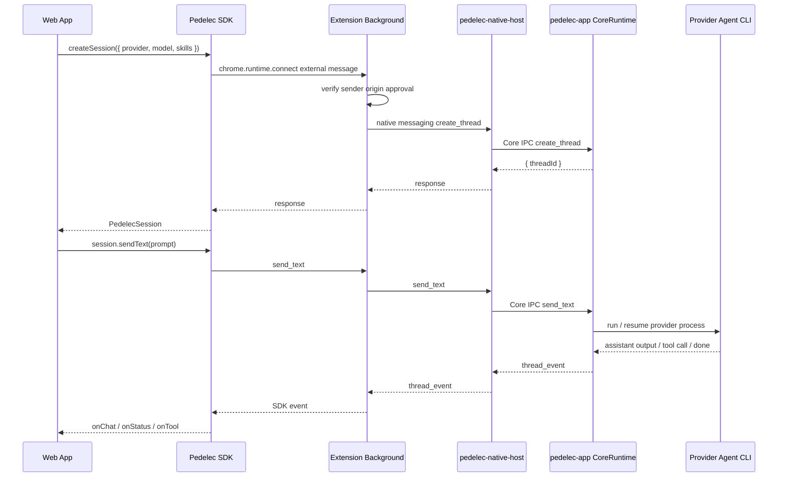

English | [繁體中文](./README.zh-TW.md)

---

## Thanks for your patience — just a little longer.

The Pedelec App is still under review, but we expect the first official Windows and macOS desktop versions to be available very soon.

In the meantime, you can install:

1. **Chrome Extension**
   Install the [Pedelec Chrome Extension](https://chromewebstore.google.com/detail/pedelec/ogccgaminlphbkeghldidiiimajfdpag).

2. **Desktop App**
   Because the app is not yet code-signed, you may see a security warning. It has been submitted to the Microsoft Store, and the macOS version will be submitted next.
   Download the latest unsigned release from [Releases](https://github.com/kaoruisaac/pedelec/releases).
   - Windows: During installation, select **More info** > **Run anyway**.
   - macOS: After installing the DMG, run `xattr -dr com.apple.quarantine \"/Applications/Pedelec.app\"`.

3. **Demo Site**
   - [Shape Rain](https://shape-rain.isaac-lin.cc/)

---

### ➡️ [Pedelec Document](https://kaoruisaac.github.io/pedelec) 🔗

Pedelec is a bridge architecture that lets web frontends call local AI coding agents.

Its core goal is: **to let a Web App create agent sessions through the SDK, send user messages, receive streamed agent responses, and safely hand tool calls back to the Web App whenever the agent needs to operate on frontend state.**

The overall data flow can be understood as:

```txt
Web App / SDK
  ↓ chrome.runtime.connect(extensionId)
Chrome Extension Background
  ↓ origin approval gate
  ↓ Chrome Native Messaging
pedelec-native-host
  ↓ Core IPC
pedelec-app Desktop Runtime
  ↓ provider process
Codex / Gemini / OpenCode / Cursor / Claude Code / Ollama via pedelec-agent
```

The Web App does not directly touch local processes and does not need to start its own localhost server. The SDK only communicates with the extension; the extension forwards requests to the native host; the desktop app is the only CoreRuntime owner and is responsible for creating sessions, managing provider processes, forwarding events, and handling tool results.

---

## Repo Structure

```txt
sdk/        TypeScript SDK used by Web Apps
extension/  Chrome extension responsible for external SDK connections, origin approval, and the native messaging bridge
desktop/    Tauri desktop app, CoreRuntime, native host, and pedelec-cli
```

---

## Top-Level Architecture



### Responsibilities of Each Layer

| Layer | Responsibility |
| --- | --- |
| SDK | Provides the Web App API, maintains session callbacks, handles request timeouts and event deduplication |
| Background | Manages SDK external channels, origin approval, native host connections, and converts core events into SDK events |
| Native Host | Chrome Native Messaging entry point that forwards requests/events to Core IPC |
| Desktop Runtime | The only session/runtime owner, managing threads, skills, provider processes, and tool requests |
| Agent process | Actually runs Codex/Gemini/OpenCode/Cursor/Claude Code/Ollama and calls frontend tools through `pedelec-cli` |

---

## Development Workflow

### Development Extension ID

When using the unpacked extension, first create `.env.local` in the repo root:

```txt
PEDELEC_DEV_CHROME_EXTENSION_ID=mifjcaefhmigmhmejhficbnhgnecfibk
```

Desktop debug builds and the demo dev server read this value. If it cannot be read or the format is invalid, the production extension ID is used.

### Starting the Desktop App

```bash
cd desktop
npm install
npm run tauri dev
```

### Loading the Chrome Extension

1. Open `chrome://extensions`.
2. Enable Developer mode.
3. Click **Load unpacked**.
4. Select the `extension/` folder.
5. Start or restart the Desktop App so it registers the native messaging host.

### Building the SDK

```bash
cd sdk
npm install
npm run build
```
