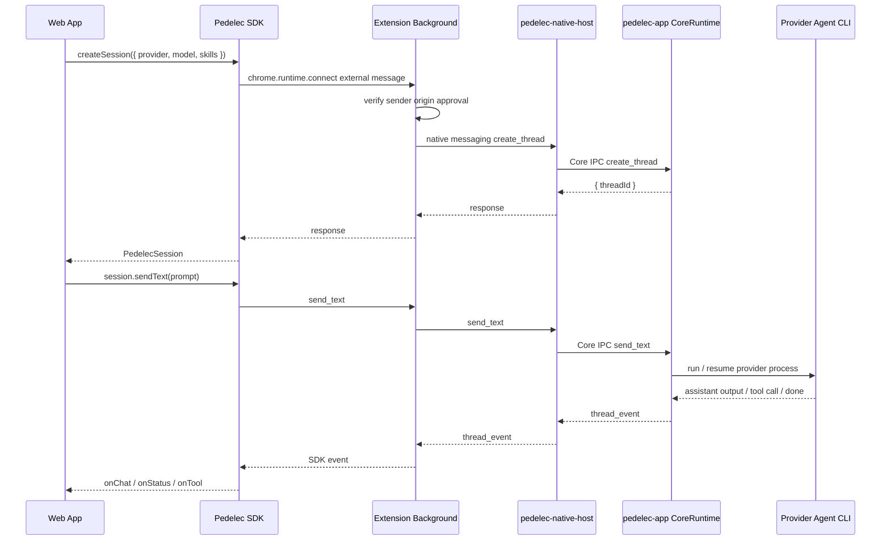

# Pedelec
[English](./README.md) | 繁體中文

---
## 請再稍等一下子
Pedelec App 目前還在審核階段， 相信正式的第一版 Windows 跟 MacOS desktop app 可以很快跟大家見面
---

Pedelec 是一套讓網頁前端可以呼叫本機 AI coding agent 的橋接架構。

它的核心目標是：**讓 Web App 透過 SDK 建立 agent session、傳送使用者訊息、接收 agent 串流回應，並在 agent 需要操作前端狀態時，把 tool call 安全地交回 Web App 處理。**

整體資料流可以想成：

```txt
Web App / SDK
  ↓ chrome.runtime.connect(extensionId)
Chrome Extension Background
  ↓ origin approval gate
  ↓ Chrome Native Messaging
pedelec-native-host
  ↓ Core IPC
pedelec-app Desktop Runtime
  ↓ provider process
Codex / Gemini / OpenCode / Cursor / Claude Code / Ollama via pedelec-agent
```

Web App 不直接碰本機 process，也不需要自己開 localhost server。SDK 只負責和 extension 溝通；extension 負責把請求送到 native host；desktop app 是唯一的 CoreRuntime owner，真正負責建立 session、管理 provider process、轉發事件與處理 tool result。

---

## Repo 結構

```txt
sdk/        Web App 端使用的 TypeScript SDK
extension/  Chrome extension，負責 external SDK connection、origin approval 與 native messaging bridge
desktop/    Tauri desktop app、CoreRuntime、native host、pedelec-cli
```

---

## SDK 使用前提

Pedelec SDK 必須在瀏覽器頁面環境中執行，並且需要：

1. 使用者已安裝 Pedelec Chrome Extension。
2. 使用者已啟動 Pedelec Desktop App。
3. Desktop App 已註冊 Chrome Native Messaging host。
4. 目標 provider 在使用者本機可用。CLI 型 provider 使用 `codex`、`gemini`、`opencode`、`cursor` 或 `claude`；Ollama provider 使用 Pedelec 隨附的 `pedelec-agent`。

SDK 不適合直接在 Node.js、SSR server 或 background worker 裡使用；它需要 Chrome 頁面環境中的 extension runtime messaging。

---

## 安裝與引用 SDK

SDK 套件位於 `sdk/`：

```bash
cd sdk
npm install
npm run build
```

在 Web App 端引用：

```ts
import { Pedelec, defineTool } from "@kaoruisaac/pedelec";
```

如果尚未發布到 npm，可以先用本地 path 安裝：

```bash
npm install ../path/to/pedelec/sdk
```

---

## 最小使用範例

```ts
import { Pedelec, defineTool } from "@kaoruisaac/pedelec";

const pedelec = new Pedelec();

const session = await pedelec.createSession({
  provider: "codex",
  model: "gpt-5",
  skills: {
    guidance: "需要瀏覽器頁面資訊時使用 get_current_page。",
    tools: [
      defineTool({
        name: "get_current_page",
        description: "讀取目前瀏覽器頁面的 title 與 URL。",
        argsSchema: {
          type: "object",
          properties: {},
          required: [],
        },
        handler: () => ({
          url: location.href,
          title: document.title,
        }),
      }),
    ],
  },
});

session.onChat((text) => {
  // agent 的文字串流增量
  console.log(text);
});

session.onStatus((status) => {
  // idle | running | waiting_tool_result | ended | error
  console.log("status", status);
});

session.onError((error) => {
  console.error(error.code, error.message, error.details);
});

await session.sendText("請幫我分析目前頁面的狀態");
```

`sendText()` 會在本輪 agent 回應完成後 resolve；如果 session 已經在處理上一個 prompt，新的 `sendText()` 會被拒絕，避免同一個 session 同時跑多個請求。

---

## 建立 Session

首次在某個 origin 呼叫 `createSession()` 或 `resumeSession()` 時，extension 會要求使用者在 popup 中核准該 origin。核准後同一個 origin 之後可直接建立 session。

可以先查詢目前 origin 的 approval 狀態，用來決定是否顯示「Connect Pedelec」類 UI：

```ts
const status = await pedelec.getApprovalStatus();

console.log(status.installed, status.approved, status.origin);
```

### 指定 provider 與 model

```ts
const session = await pedelec.createSession({
  provider: "opencode",
  model: "ollama/qwen2.5-coder:14b",
});
```

目前 SDK 支援的 provider code：

| Provider | Code | model 範例 |
| --- | --- | --- |
| Codex | `codex` | `gpt-5` |
| Gemini | `gemini` | provider 自己支援的 model id |
| OpenCode | `opencode` | `ollama/qwen2.5-coder:14b` |
| Cursor | `cursor` | `gpt-5` |
| Claude Code | `claude` | `sonnet` |
| Ollama | `ollama` | `qwen3-14b-32k:latest` |

Ollama session 由 Desktop App 隨附的 `pedelec-agent` 執行，不會直接啟動 `ollama` CLI。使用者仍需自行啟動本機 Ollama server，且必須明確指定 model 或在 Settings 設定 `defaultModels.ollama`：

```ts
const session = await pedelec.createSession({
  provider: "ollama",
  model: "qwen3-14b-32k:latest",
});
```

### 使用 Desktop App 預設 provider

如果 Desktop App 已設定 default provider，可以不傳 `provider`：

```ts
const session = await pedelec.createSession({
  skills: {
    guidance: "使用者要求更新 counter 時使用 update_counter。",
    tools: [
      defineTool({
        name: "update_counter",
        description: "依照 delta 更新畫面上的 counter。",
        argsSchema: {
          type: "object",
          required: ["delta"],
          properties: {
            delta: {
              type: "number",
              description: "Counter delta.",
            },
          },
        },
      }),
    ],
  },
});
```

這會先讀取 Desktop App 的 `defaultProvider` 與 `defaultModels`。如果沒有設定 default provider，SDK 會拋出 `DEFAULT_PROVIDER_NOT_SET`。如果該 default provider 有自己的 default model，SDK 會在建立 session 時帶上該 model。

### 只指定 provider

```ts
const session = await pedelec.createSession({
  provider: "codex",
});
```

只傳 `provider` 時，SDK 會使用該 provider 在 Desktop App 中設定的 default model；若該 provider 未設定 model，則只傳 provider，讓 provider CLI 使用自己的預設行為。
Ollama 是例外：它必須有 model，因此只傳 Ollama provider 時需要 `defaultModels.ollama`，否則會回傳 `MODEL_REQUIRED`。

### Session 生命週期

SDK 建立的 session 預設是 page-scoped。`autoEndOnDisconnect` 預設為 `true`，因此頁面重新整理、關閉 tab，或該 session 的最後一個 SDK connection 中斷時，Pedelec 會自動結束對應的 Desktop thread。

Demo 與 page-scoped app 建議使用預設值。若需要在頁面切換後 `resumeSession`，或跨頁共用同一個 session，請明確設定 `autoEndOnDisconnect: false`：

```ts
const session = await pedelec.createSession({
  provider: "codex",
  autoEndOnDisconnect: false,
});
```

---

## 查詢 Providers

```ts
const providers = await pedelec.listProviders();

for (const provider of providers) {
  console.log(provider.code, provider.available, provider.path, provider.error);
}
```

回傳格式：

```ts
type ProviderInfo = {
  name: string;
  code: "codex" | "gemini" | "opencode" | "cursor" | "claude" | "ollama";
  path: string | null;
  available: boolean;
  error: string | null;
};
```

`available: false` 通常代表該 provider CLI 沒有安裝，或不在 PATH 裡。
對 Ollama 而言，`available: true` 只代表 Pedelec 找得到 `pedelec-agent`；不代表 Ollama server 已啟動，也不代表指定 model 已下載。

---

## 讀取 Desktop App 設定

```ts
const settings = await pedelec.getSettings();

console.log(settings.defaultProvider);
console.log(settings.defaultModels.codex);
console.log(settings.defaultModels.gemini);
console.log(settings.defaultModels.ollama);
```

回傳格式：

```ts
type PedelecSettings = {
  defaultProvider: "codex" | "gemini" | "opencode" | "cursor" | "claude" | "ollama" | null;
  defaultModels: Partial<Record<"codex" | "gemini" | "opencode" | "cursor" | "claude" | "ollama", string>>;
};
```

---

## 接收 Agent 回應

```ts
const chunks: string[] = [];

session.onChat((text) => {
  chunks.push(text);
  render(chunks.join(""));
});
```

`onChat()` 收到的是文字增量，不一定是一整句，也不一定是一整段。UI 通常需要自己累積成完整訊息。

---

## 監聽 Session 狀態

```ts
session.onStatus((status) => {
  switch (status) {
    case "idle":
      break;
    case "running":
      break;
    case "waiting_tool_result":
      break;
    case "ended":
      break;
    case "error":
      break;
  }
});
```

常見狀態：

| 狀態 | 意義 |
| --- | --- |
| `idle` | session 可接收下一個 prompt |
| `running` | agent 正在處理使用者輸入 |
| `waiting_tool_result` | agent 發出 tool call，正在等待前端回傳結果 |
| `ended` | session 已結束 |
| `error` | session 發生錯誤 |

---

## Tool Calling：讓 Agent 操作 Web App

Pedelec 的 tool calling 流程是：

1. Web App 在 `createSession` 提供 `skills: { guidance, tools }`。
2. Desktop Runtime 驗證 manifest，並在 sandbox 產生 `skills/tools.md` 與 per-tool spec 檔案。
3. Agent 需要前端資料或操作時，先讀 `tools.md`，用 `pedelec-cli tool-spec <tool>` 查規格，再執行 `pedelec-cli tool-call ...`。
4. Desktop Runtime 收到 tool call 後，透過 native host 與 extension 送回 SDK。
5. SDK 觸發 `session.onTool()`。
6. Web App 執行對應工具並 return result。
7. SDK 自動把 result submit 回 Desktop Runtime，再交給 agent 繼續推理。

每個 `defineTool` 使用 `argsSchema` 描述 tool arguments，這份描述會送給 provider / agent。root schema 必須是 object。`argsSchema` 是 Pedelec Tool Args Schema subset，不是完整 JSON Schema；它支援常見的 `string`、`number`、`integer`、`boolean`、`array`、`object`、`oneOf` node，以及 `description`、`default`、`examples`、`enum`、數值範圍、array 長度限制與 `required` 等欄位。`default` 只是給 agent 的提示，SDK 不會自動補值。舊的 shorthand `input` schema 不再支援。第一版也不支援 `$defs`、`$ref`、`additionalProperties`、`exclusiveMinimum`、`exclusiveMaximum`、`multipleOf`、`format`；需要重用 schema 時請用 TypeScript const。

範例：

```ts
session.onTool(async (tool, args) => {
  if (tool === "get_current_page") {
    return {
      url: location.href,
      title: document.title,
      selectedText: window.getSelection()?.toString() ?? "",
    };
  }

  if (tool === "update_counter") {
    const { delta } = args as { delta: number };
    counter.value += delta;
    return {
      counter: counter.value,
      delta,
    };
  }

  return {
    error: {
      code: "TOOL_NOT_FOUND",
      message: `Unknown tool: ${tool}`,
    },
  };
});
```

`onTool()` 的回傳值必須可以 JSON serialize。SDK 會自動把回傳值送回 runtime，不需要手動呼叫 `submit_tool_result`。

---

## Resume 既有 Session

如果你有保存 `sessionId`，可以重新接回既有 session：

```ts
const session = await pedelec.resumeSession("thread_abc123");

session.onChat((text) => {
  console.log(text);
});

await session.sendText("繼續剛剛的工作");
```

---

## 結束 Session

```ts
await session.end();
```

結束後，該 session 不能再呼叫 `sendText()`。如果需要新的對話，請重新 `createSession()`。

若啟用 `autoEndOnDisconnect`，disconnect cleanup 的目標與呼叫 `session.end()` 相同：thread 會被結束，且不再被視為 active。

---

## 錯誤處理

建議所有 SDK 操作都包在 `try/catch`，並同時註冊 `onError()`：

```ts
session.onError((error) => {
  console.error("session error", error);
});

try {
  await session.sendText("請幫我修改這段內容");
} catch (error) {
  console.error("send failed", error);
}
```

常見錯誤：

| code | 可能原因 |
| --- | --- |
| `EXTENSION_UNAVAILABLE` | SDK 不在瀏覽器頁面中執行，或 extension 無法連線 |
| `EXTENSION_DISCONNECTED` | extension 連線中斷 |
| `SDK_BRIDGE_TIMEOUT` | extension 沒有在 timeout 內回應 |
| `APPROVAL_REJECTED` | 使用者拒絕目前 origin 使用 Pedelec |
| `APPROVAL_TIMEOUT` | 使用者未在期限內完成 origin approval |
| `OPEN_POPUP_FAILED` | extension 無法自動開啟 approval popup |
| `NATIVE_HOST_UNAVAILABLE` | Chrome Native Messaging host 無法連線 |
| `DEFAULT_PROVIDER_NOT_SET` | Desktop App 尚未設定 default provider |
| `DEFAULT_PROVIDER_UNAVAILABLE` | default provider 不可用 |
| `SESSION_BUSY` | 同一個 session 已有 prompt 正在執行 |
| `SESSION_ENDED` | session 已結束 |
| `TOOL_HANDLER_NOT_FOUND` | agent 呼叫 tool，但 Web App 沒有註冊 handler |

---

## 頂層架構



### 每一層的責任

| 層級 | 責任 |
| --- | --- |
| SDK | 提供 Web App API、維護 session callback、處理 request timeout 與事件去重 |
| Background | 管理 SDK external channel、origin approval、連線 native host、把 core event 轉成 SDK event |
| Native Host | Chrome Native Messaging 入口，轉送 request/event 到 Core IPC |
| Desktop Runtime | 唯一的 session/runtime owner，管理 thread、skills、provider process 與 tool request |
| Agent process | 實際執行 Codex/Gemini/OpenCode/Cursor/Claude Code/Ollama，並透過 `pedelec-cli` 呼叫前端工具 |

---

## 開發流程

### 開發用 Extension ID

如果使用 unpacked extension，先在 repo 根目錄建立 `.env.local`：

```txt
PEDELEC_DEV_CHROME_EXTENSION_ID=mifjcaefhmigmhmejhficbnhgnecfibk
```

Desktop debug build 與 demo dev server 會讀取這個值；讀不到或格式不正確時會使用正式 extension ID。

### 啟動 Desktop App

```bash
cd desktop
npm install
npm run tauri dev
```

### 載入 Chrome Extension

1. 開啟 `chrome://extensions`。
2. 開啟 Developer mode。
3. 點選 **Load unpacked**。
4. 選擇 `extension/` 資料夾。
5. 啟動或重啟 Desktop App，讓它註冊 native messaging host。

### 建置 SDK

```bash
cd sdk
npm install
npm run build
```

---

## 設計重點

- Web App 只依賴 SDK，不直接知道 native host 或 Core IPC 細節。
- Extension 是 Web App 與本機 runtime 的唯一瀏覽器橋接層。
- Desktop App 是唯一 CoreRuntime owner，避免 extension、native host、desktop 同時建立各自的 session state。
- Agent 不直接操作 Web App；它只能透過 `pedelec-cli` 發出 tool call，再由 SDK 交給 Web App 決定是否執行。
- Tool result 由 Web App 回傳，runtime 再交給 agent，讓前端狀態與本機 agent 能保持同步。
