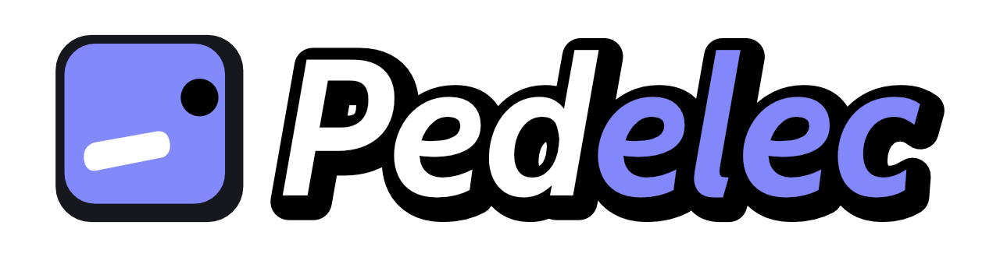
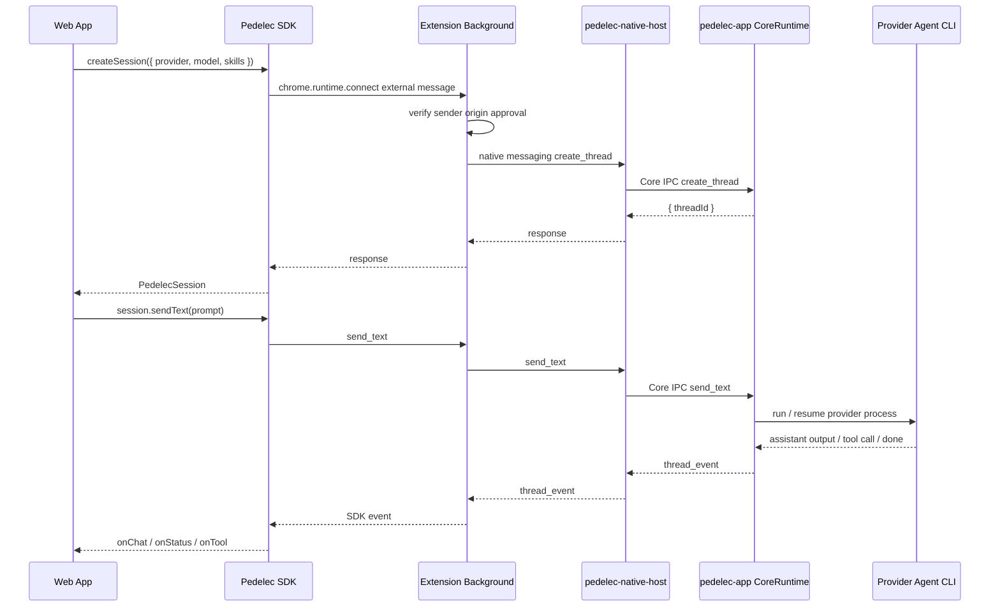

[English](./README.md) | 繁體中文

---

## 請再稍等一下子

Pedelec App 目前還在審核階段， 相信正式的第一版 Windows 跟 MacOS desktop app 可以很快跟大家見面
在此之前你可以從這裡安裝:

1. Chrome Extension
  從這裡安裝 [Pedelec Chrome Extension](https://chromewebstore.google.com/detail/pedelec/ogccgaminlphbkeghldidiiimajfdpag)

2. Desktop App
  目前尚未申請簽章所以會看到風險保護提示，先送審 Microsoft Store 了，蘋果的部分會接續送審
  從 [Rlease](https://github.com/kaoruisaac/pedelec/releases) 下載未簽章的最新版本，
  - Windows: 安裝時選擇 "其他資訊 > 仍要執行"
  - MacOS: 安裝dmg後執行 ``` xattr -dr com.apple.quarantine "/Applications/Pedelec.app" ```

3. Demo Site
  - [Shape Rain](https://shape-rain.isaac-lin.cc/)

---

### ➡️ [Pedelec 文檔](https://kaoruisaac.github.io/pedelec/zh-tw) 🔗

Pedelec 是一套讓網頁前端可以呼叫本機 AI coding agent 的橋接架構。

它的核心目標是：**讓 Web App 透過 SDK 建立 agent session、傳送使用者訊息、接收 agent 串流回應，並在 agent 需要操作前端狀態時，把 tool call 安全地交回 Web App 處理。**

整體資料流可以想成：

```txt
Web App / SDK
  ↓ chrome.runtime.connect(extensionId)
Chrome Extension Background
  ↓ origin approval gate
  ↓ Chrome Native Messaging
pedelec-native-host
  ↓ Core IPC
pedelec-app Desktop Runtime
  ↓ provider process
Codex / Gemini / OpenCode / Cursor / Claude Code / Ollama via pedelec-agent
```

Web App 不直接碰本機 process，也不需要自己開 localhost server。SDK 只負責和 extension 溝通；extension 負責把請求送到 native host；desktop app 是唯一的 CoreRuntime owner，真正負責建立 session、管理 provider process、轉發事件與處理 tool result。

---

## Repo 結構

```txt
sdk/        Web App 端使用的 TypeScript SDK
extension/  Chrome extension，負責 external SDK connection、origin approval 與 native messaging bridge
desktop/    Tauri desktop app、CoreRuntime、native host、pedelec-cli
```

---

## 頂層架構



### 每一層的責任

| 層級 | 責任 |
| --- | --- |
| SDK | 提供 Web App API、維護 session callback、處理 request timeout 與事件去重 |
| Background | 管理 SDK external channel、origin approval、連線 native host、把 core event 轉成 SDK event |
| Native Host | Chrome Native Messaging 入口，轉送 request/event 到 Core IPC |
| Desktop Runtime | 唯一的 session/runtime owner，管理 thread、skills、provider process 與 tool request |
| Agent process | 實際執行 Codex/Gemini/OpenCode/Cursor/Claude Code/Ollama，並透過 `pedelec-cli` 呼叫前端工具 |

---

## 開發流程

### 開發用 Extension ID

如果使用 unpacked extension，先在 repo 根目錄建立 `.env.local`：

```txt
PEDELEC_DEV_CHROME_EXTENSION_ID=mifjcaefhmigmhmejhficbnhgnecfibk
```

Desktop debug build 與 demo dev server 會讀取這個值；讀不到或格式不正確時會使用正式 extension ID。

### 啟動 Desktop App

```bash
cd desktop
npm install
npm run tauri dev
```

### 載入 Chrome Extension

1. 開啟 `chrome://extensions`。
2. 開啟 Developer mode。
3. 點選 **Load unpacked**。
4. 選擇 `extension/` 資料夾。
5. 啟動或重啟 Desktop App，讓它註冊 native messaging host。

### 建置 SDK

```bash
cd sdk
npm install
npm run build
```